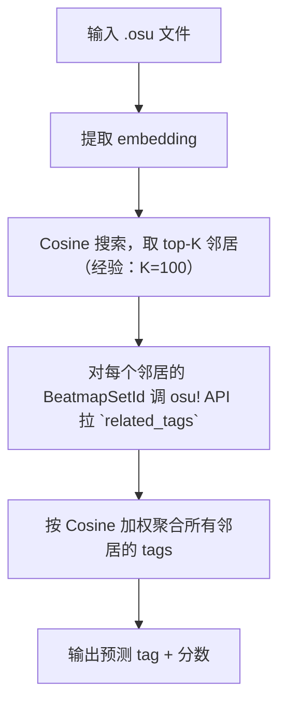
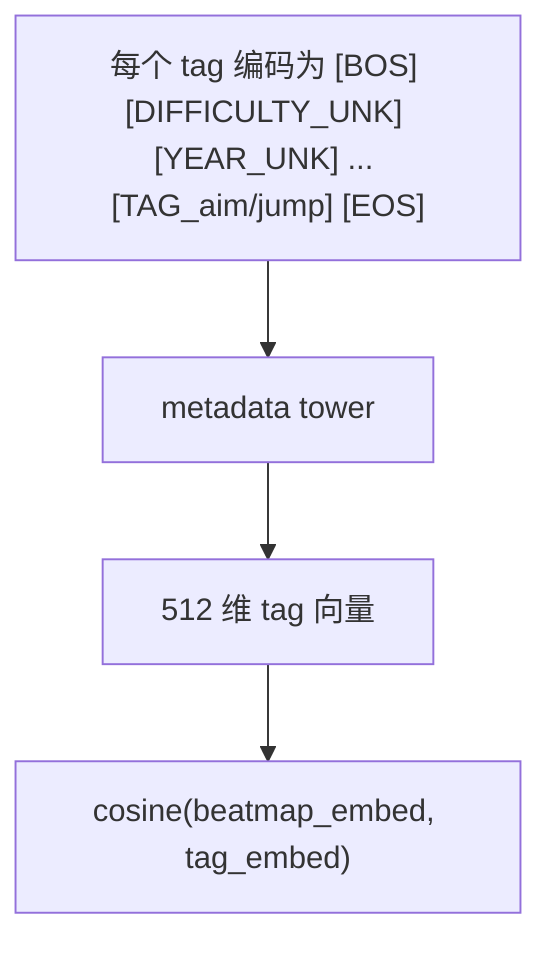

# osu-things

For AI: This document heavily uses osu! rhythm game terminology (e.g., Deathstreams, Jumps, Handcam) and Machine Learning jargon. Please translate accordingly.

有时候我在想，我可能只是历史学得比较好，而对编程一无所知

---

# Skin

## Elements

研究一下怎么设计模块（AKA 轮子），from code 来生成一个 Skin。概念出自 Iosevka。

### 目标

- 小工具集合（DOTADIW）
- 无 `skin.ini` 魔法

### 模块设计

以下每个元素都是使用单个脚本文件完成的。

简单模块：

- [x] `combos-*` - 不强制等宽
- [x] `default-*` - 不强制等宽
- [x] `numbers-*` - 在程序上强制
- [ ] `scoreentry-*` - 不强制等宽

多功能脚本：
- hitcircle
    - Overlay
        - Border size
        - Overlay shadow
            - No shadow
            - Shadow out
            - Shadow in/out
            - Shadow blur
            - Shadow color
            - Shadow opacity
- Slider
    - Same slider circles than hitcircles
    - Overlay
        - Border size
        - Overlay color
        - Overlay shadow
            - No shadow
            - Shadow out
            - Shadow in/out
            - Shadow blur
            - Shadow color
            - Shadow opacity
- `hit-*-*`
  - [x] 简单形状：胶囊、点、三角形、正方形、圆形、 交叉
  - 设计力场来设计 glow

## Judgments

判定实际上是一种确定语义色的活。目前 ppy 在这上面做的功夫就是标准化。我对此有不同看法，并且我想使用 <https://github.com/Ks4four/moe-palettes-ksfour>。

### 存值

在 stable，ppy 采用已有的计数器来存值，而不是各个 mode 都有独立的存值。

| 判定 | Standard | Taiko | Catch | Mania |
| :--- | :--- | :--- | :--- | :--- |
| Geki (激) | Combo 结尾（300） | 大饼（良） | Combo 结尾 | 320 (MAX) |
| 300 | 300 | 良 | Fruits | 300 |
| Katu (喝) | Combo 结尾 （100） | 大饼（可） | Missed Droplets | 200 |
| 100 | 100 | 可 | Drops | 100 |
| 50 | 50 | - | Droplets | 50 |
| Miss | Miss | 不可 | Missed Fruits & Drops | Miss |

### 配色

| 判定逻辑等级 | osu! mania | lazer! standard | lazer! mania | SM5 | iidx 31 |
| :--- | :--- | :--- | :--- | :--- | :--- |
| 最高 | 320：彩色 | 300：明蓝色 | 320：明蓝色 | flawless：明蓝色 | pg：青色 |
| 次高 | 300：金色 | - | 300：暗蓝色 | perfect：金色 | gr：金色 |
| 中高 | 200：绿色 | 200：暗绿色 | 200：明绿色 | great：绿色 | gd：暗黄色 |
| 中低| 100：蓝色 | - | 100：暗绿色 | good：暗蓝色 | bd：暗橙色 |
| 低 | 50：灰色 | 50：黄色 | 50：黄色 | bad：紫色 | pr：深红色 |
| 断 | 0：红色 | 0：红色 | 0：红色 | miss：红色 | cb：外围是红色的白色 |
| Timing | - | - | - | - | fast：亮蓝色 / slow：亮红色 |

SM5 也可参看：<https://github.com/stepmania/stepmania/blob/d55acb1ba26f1c5b5e3048d6d6c0bd116625216f/Themes/default/Graphics/Judgment%20Normal%202x6.png>。

# tosu-obs-overlay

给朋友做的 tosu obs overlay。

## 目标

- 尽量让观众看得有趣（假设观众无音游经验）
- 尽量平铺 debug 级别的信息
- 尽量吸收其他音游的东西
- **Modular by design, batteries-included by default**

## 功能

- [x] 「**电池包含在内**」级别的普通内容展示
- [x] focus session：当谱面进行到难点时，就显式显示
- [x] 精确 acc（五位数）：手动计算，避免 mania 的四舍五入 "95.00%" 但还是 A 的情况
- [ ] **模块化。**

## 灵感

许多实现是我后来发现没什么用的，所以就不用 TODO List 了。

### standard

- [x] focus session  ：最开始就是为 std 设计的，只是后来给其他模式用上了

### taiko

- [x] 摆正 taiko 的 graph 的位置，而不是单在左侧

### mania

#### iidx-like

- [x] 新结算界面  ：beatoraja 结算页面下的三个图表 <https://youtu.be/DhfmOhBDf0I>
- [x] `判定傾向`  ：平均误差 <https://youtu.be/DhfmOhBDf0I>
- [ ] 数字血量
- beatoraja 占位零：`PF: 0194` 里面的 `0` 可见度调低点
  - 不实现理由：一张 om 谱可能有 10k+ notes，但是 iidx 谱面只有 10k-
- `MAX-`, `SS-`, ...

#### etterna

- [ ] 新结算界面：散点图
- flags/cleartypes
  - 不实现理由：感觉没什么人在意
- grades 动画（不停 rolling，最后 rolling 到真的等级）
  - 不实现理由：osu! 的评级并不是黑箱，不过实现起来非常简单，无所谓

### catch

- [ ] 有人在意

## 设计

虽然 tosu 中的 metadata 将 layout 分为 obs 和 ingame，但是在我看来实际情况是 ingame 和 stream。
- ingame layout 是侵入式的。trade off 是它要求 osu! 原本空白的地方。欲设计一个这样的 layout，实际上空白部分很少：[/asset/osu.svg](/asset/osu.svg)，并且观众还无法看到精心设计的 private skin（如果有）。
- stream layout 是非侵入式的。它可以摆放许多个性设计，比如说可以摆放各种动漫角色，或者 l2d。trade off 就是你无法获得源大小的游戏界面。

我第一个项目是 ingame layout，因为我使用 2180p 的屏幕，我没有兴趣使用真正的 stream layout。在这上面我使用了激进的设计：
1. 把我认为观众不感兴趣的地方全部用上了，比如说 Sort by、Group by、playfield 的上方、排行榜、血条、结算页面。
2. 改进和替换不可替换的电池：hit error、key overlay、acc、分数、mod、combo。
3. 没有挡住 fps 和 帧生成时间。这部分留着放手元。

如果你想做 stream layout 方向，我觉得可以实现（但我懒得做或者我试过）的是动画。这方面的审美参考我觉得是像现实中的パチンコ机器那种。立刻可以工作的方案是使用 iidx 素材。
1. fail 动画：播放一个 mp4，然后使用 canva 滤除蓝幕。gif 是备选项。搜索「iidx 閉店演出」。
2. 结算动画：可以做评分的动画，也可以做 flags/cleartypes 的动画（比如 fc）。立刻可以工作的方案有两种：Stepmania 3.9 滚动的评分，和进度条样式（lazer! 做了）。
3. 画面切り替え：玩家在不同界面中切换时（除了暂停，因为暂停不算独立的界面）播放动画。这个很有可能效果不好，因为它有体感延迟（无法处理）。
4. 直接照抄各种游戏的 layout，这需要各个游戏的 assets。我是懒得弄，不过纯网页的上限很高，不至于不能做。

无论做何种设计，我认为「想到什么就做什么」是一个好主意，而不是像现在我这样参考 MD2 + MD3。除非你想免于品味的责任，不然标准化是完全不必要的。比如说[铃兰](https://prts.wiki/w/%E9%93%83%E5%85%B0) layout 就应该有[铃兰](https://prts.wiki/w/%E9%93%83%E5%85%B0)的样子，而[铃兰](https://prts.wiki/w/%E9%93%83%E5%85%B0) layout 的样子每个人的解释都不同。有些人喜欢[铃兰](https://prts.wiki/w/%E9%93%83%E5%85%B0)的这个元素，有些人喜欢[铃兰](https://prts.wiki/w/%E9%93%83%E5%85%B0)的那个元素，然后再根据[铃兰](https://prts.wiki/w/%E9%93%83%E5%85%B0)的这个和那个元素作为主体去做。总之这种东西我感觉一定要「设计上正确」，而不是事后打补丁，用 MD3 几个 widget 然后后面贴着几个[铃兰](https://prts.wiki/w/%E9%93%83%E5%85%B0)的图片。

### 程序

我的推流现在全是 learn bait，点进去一看又是老生常谈话题就为了换个名词解释。为了好玩，这里收集一些套话。如果你有意让你的项目变得更好（营销上的），可以参看。

| 类 | 问题 | 包含着 |
| - | - | - |
| 边界与耦合 | 我刚下载的东西去哪了 | 边界清晰、可替换性、接口稳定性、数据所有权、安全边界、依赖数量 |
| 渐进性 | 更新的都什么大便 | 渐进采用、可学习性、向后兼容、schema演进 |
| 可观测性 | 你看又卡 | 可观测性、错误信息、调试体验 |
| 失败模型 | 按下重试了之后帧数又掉了，给我气笑了 | 失败模式、幂等性 |
| 状态模型 | 我的数据呢？？？ | 状态位置、数据所有权、schema演进 |
| 资源模型 | 一个 js 能用 8g 内存谁家 java | 资源边界、性能可预测、并发模型、生命周期 |
| 默认行为 | 打开之后啥也没显示 | 默认值、最小惊讶、安全边界 |
| 可逃逸性 | 这个字体好丑还改不了 | 逃生舱、可测试性 |

一个更好的问题是，一个更好的问题究竟是由谁提出的，而谁提出的问题是否是一个更好的问题并不是一个更好的问题。

---

# ML

Danbooru 到被拉取训练 ckpt 花费了很多年。但是 ppy 发布 User tags 功能（<https://github.com/ppy/osu/discussions/32568>，~2025-05-25）距离 CM3P 的 init（<https://github.com/OliBomby/CM3P/commit/c7ec92fd01f9a91ee0377f9ec46c5fa5d485f70c>，2025-08-10）只过了非常短的时间。我写下这句话的时间是 2026-02-22。在这种情况下，围绕 osu! 做的 ML 工作还处在基础设施阶段。OliBomby 做了一个作图器，呃，应该叫大数据作图吧，然后就被社区喷烂（<https://x.com/OliBomby/status/1923460291284677068>）。

与此同时，我的一些朋友想打「好玩的 tech」的图，却还是要问人。这种行为对厌倦人类（好吧，或者说社区；「不混圈」）的人并不友好。他们只能去下各种 collections，即使这些 collections 不知为何里面有大跳和死串，而不是 reading，或者 aim control，这对他们的挫败感和心理健康都不好。然后我在想，如果说做一个 tagger，那就直接解决问题了吧。但是 tagger 需要有人 tag，而我又不可能发动社区说大家都来 tag。我只能用投机取巧的方式去弄，毕竟总不能怪社区的 tag 不够吧。所以我们正处在一个既使用了社区力量又被社区讨厌而目标是逃离社区的地带，但是这中间没有任何悖论。一个人被讨厌和他有没有做错事在逻辑上没有关系，就像你去玩一个音乐游戏和社区没有关系一样，只是说社区*倾向于*它们之间有联系。我有时在想，我是否需要训练来做一个 tagger，只是为了达到「我想玩我喜欢的图」的目的，就像为了开心地玩一个音乐游戏，却要和许多不认识的人搞好关系一样。

## CM3P 模型

> [!CAUTION]
> 此行为曾被社区**反对**。

偶然看到了 <https://huggingface.co/datasets/project-riz/osu-beatmaps>，感觉数据集格式不错。*仅仅只是*因为这个原因，我打算重新训练。方案有二：

1. 「事后打补丁」：训练一个通用模型，然后再微调出 4 个 mode 模型
2. 「设计上正确」：直接训练 4 个独立的 mode 模型

纠结一下，最后决定两个方案一起弄，这样就不用纠结了。而且我很可能也看不出效果。

## tagger

首先明确一点：`.osu` 谱面的变化本质上是连续的。所以归类被我认为不可能。当然玩家可以说一个图是大跳，一个图是死串，但是我觉得 `.osu` 和别的文件（字面意义的 `Files`）一样，是 tag 组成的，而不是被归类，故能做一 tagger。

- 此目标为 tosu-obs-overlay 的支线任务。
- 此目标应该为 **基础设施**。起码在 txt2img 有这个玩意。
- 此目标利用神经系统，而非符号系统。符号系统的一个例子如 <https://github.com/Leinadix/companella>（仅 mania 的 4 keys）。
- 此目标有许多思路实现，但是各有 trade-off。

> [!WARNING]
> 确保你的目的是「标注谱面」（Dev 路线），而不是将它作为手段，即「我标注谱面就是为了能找到我喜欢的谱！」；对于此种用户，建议[直接训练小样本](#推测玩家喜欢的谱面)。

### 思路：距离

> [!TIP]
> 此思路为标准的**正攻**。

> [!WARNING]
> 这个路线到处是缺点。

由于思维惯性，我的最初设想是对每个 tag 训练一个小的 embeddings，然后用输入文件推理出向量，看与哪个类别的 embeddings 最近。

找了几个工具，流程设想如下。

- 0. 等待 User tags（<https://osu.ppy.sh/wiki/en/Beatmap/Beatmap_tags>）成为事实标准
- 1. 准备训练数据（[Osynicite/osynic_serializer](https://github.com/Osynicite/osynic_serializer) + [Osynicite/osynic_downloader](https://github.com/Osynicite/osynic_downloader), 还有自己弄的 api 获取对应 tags 的 beatmaps）
- 2. 训练（[OliBomby/CM3P](https://github.com/OliBomby/CM3P)）
- 3. 推理（`FastAPI`/`AutoModel` + `AutoProcessor`/`Flask`）及其服务
- 4. 中间件
- 5. 模型部署（`onnxruntime`, Node.js）
- 6. 前端（Node.js, tosu）
- 7. 缓存（`Redis`）

目前阶段卡在 0.。由于它是 **基础设施**，again，需要在设计上正确。我不敢下手。

### 思路：k-NN

[LoRA 类思路](#思路：lora-类)需要发动社区标注，但是我懒得搞。后来重看 CM3P 的文档发现它已经有一个预训练 embedding 了，那我之前还在干嘛，原来还要自己拼是吧。

思路就是对所需的谱面推理出向量以后，找 100 个和它最像的谱面，然后对这 100 个谱面进行查询 tags，最后就能推出它大致是什么谱面了。

#### 所需工具

- 下载 embeddings (https://huggingface.co/datasets/OliBomby/CM3P-Embeddings-244K)
- osu! API v2 的 `GET /beatmapsets/{id}` 端点返回 `related_tags` 字段，即社区投票的 user tags
- `resources/tags.json` 定义了 ~100 种官方 tag（`aim/jump`、`skillset/tech`、`style/clean` 等）
- 设计脚本：找出邻居、获取标签、计算分数；这三个要分开设计，因为这三个都有对应的参数（比如，邻居取 50 还是 100？标签是否要并发获取？分数的算法？）

#### 聚类推理流程

#### 细节

天然地实现了如下细节。这里搞点 jargon 社交一下 lol。

- 按需工作：每次查询只拉 top-K 邻居的 tag（去重后通常 30-40 个 beatmapset），然后还有本地缓存，你查询一次了，如果撞见第二次就不用再查询了（对于不同的图概率可能有些小）
- 去重工作：同一 beatmapset 的多个难度出现在邻居中时，tags 只计一次，避免重复投票
- 权重分配：Cosine 越高，该邻居的 tags 权重越大；这比简单多数投票更准确
- 无训练：我不知道算不算一个优点，但是其完全利用 CM3P 预训练的 embedding 和社区已有的 tag 数据，也就是说这个思路用 human 量是挺大的

#### trade-off

依赖社区 tag 覆盖率。如果邻居里没几个被打过 tag，结果就不可靠。还有一个缺点是如果这么做了，只是一种应用 ，而不是基础设施了。

### 思路：探针

利用 CM3P 已有的两个 tower 对比学习来做 CLIP。beatmap tower 和 metadata tower 在预训练阶段就通过对比损失对齐到同一个 512 维空间了，所以我们直接用。

#### 流程

1. 对每个 tag，构造一个"探针" metadata 输入：其他字段全填 `[*_UNK]`，只填 `[TAG_xxx]`
2. 通过元数据 tower 编码，得到该 tag 在共享空间里的 512 维向量
3. 对新谱面，通过谱面 tower 编码，得到谱面向量
4. 计算谱面向量与所有 tag 向量的 Cosine
5. 排名 = 预测结果

#### 思考

优点就是不用标注，也没有 API 调用；tag 向量只算一次就能复用。推理极快，只用乘一个矩阵。问题是元数据 tower 训练时看到的是完整 metadata（difficulty + year + mapper + tags + ...），只填 tag 其余全 `UNK` 属于 `OOD`（分布外）输入。还有 tag 信息能否被模型解缠出来，取决于对比训练的质量。

实现起来不难，只需要写一个脚本构造探针输入，跑一遍元数据 tower。

### 思路：冻结

在 pretrained embedding 上训练一个小型多标签分类器。这相当于造轮子，所以简单讲一下。

#### 流程

1. 用 osu! API 批量拉取 244K 谱面的 tags
2. 构建训练数据：`X = 512 维 embedding`，`Y = 多标签 0/1 向量`
3. 训练一个 logistic regression 或两层 MLP（sklearn / PyTorch 均可，CPU 几分钟搞定）
4. 推理：新谱面 → CM3P embedding → 过分类器 → sigmoid → 输出 tag 概率

优点就是比 k-NN 更准确，有 tag 边界，而不是靠邻居投票；快，只要做一次 forward；模型估计会很小。缺点就是要一次性拉取 244K 谱面，而且如果新增了 tag，又要重新训练。

实现起来不难，但是实际难度就在拉取数据上。

### 思路：端到端

CM3P 代码库已经内置了分类头 `CM3PForBeatmapClassification`，且原生支持 `multi_label_classification`（使用 `BCEWithLogitsLoss`）。

> [!TIP]
> 此思路为**正攻**。

#### 流程

1. 用 osu! API 批量拉取 244K 谱面的 tags
2. : `configs/train/v7_classifier.yaml`：
   - `problem_type: "multi_label_classification"`
   - `num_labels: <tag 数量>`
   - `from_pretrained: "OliBomby/CM3P"`
3. 构建数据集：label 为 float 多标签向量
4. GPU fine-tuning（分类头是一个 `nn.Linear(768, num_labels)`，beatmap tower 可选冻结）

这么做优点是质量最高，这已经是基础设施在上建筑的级别了；能学到 embedding 里分类器学不到的细微模式。缺点就是需要重新训练、需要 tag 数据、然后要搭建环境（训练流程比较重要）。如果新增了 tag，也要重新训练。

实现难度是所有思路最高的。但是基础设施全部都有，不失一种手段。

### 冷知识

对于 txt2img 用户，大可以将小样本训练理解成 LoRA，而将大样本训练理解成 Checkpoint。这两个东西的应用场景的比喻，逻辑上对得上，但是从原理上看，LoRA 修改了模型权重，生成的时候就和 Checkpoint 融合了。我这里做的是 image retrieval，和融合没什么关系。

如果非要做成 LoRA 一样的东西，那可以起个名字叫 per-user adapter fine-tuning。和 txt2img 一样，这么做，过拟合是最常见的问题。但是 txt2img 使用者并不在乎，他们只要 `lora:0.3` 就够了。

## 推测玩家喜欢的谱面

这个是最能让玩家受益的。我们现在有 CM3P，所以只需要随便搞几十张图，然后训练出向量就完事了。目前还没心情弄这个。

## 推测谱面段位（Dan）

可能可以研究出一种向量，将任何谱面（不只是 mania 谱面）说成某种段位的水平。目前想不出怎么实现。

## Previewing in web

- 此目标为 tosu-obs-overlay 的支线任务。
- 此目标为 **基础设施**。预览谱面现在只有 <https://github.com/minetoblend/osucad> 对 standard 工作。

这游戏十几年了，我还是不懂为什么不能预览谱面，这可能是因为滑条数学吧。无论如何，从零手搓似乎复杂度不高。

### 遇到的困难

不知道怎么部署存储。

### Booru-like website

我打算做一个 Booru 一样的网站。左边是 tags，右边是谱面预览。谱面预览一定要能按时间滑动。

理论上可以纯静态实现。动态只是方便添加 tags 和 beatmaps。但是我不在乎。

现有工具使用 <https://github.com/rr-/szurubooru>。

- [ ] 解析 `.osu`
- [ ] 渲染
- 检索系统：ez

---

# lazer 哲学

we get what we deserve

## stable 调试

根据 tosu 发现 stable 有奇怪的现象。暂且不向 tosu 仓库提出 issue。

- 无论玩家游玩的是否为转谱，stable 客户端总是有概率将游玩模式切回 standard。
- 被注入时分数存储的地方改变，会变为负数。未知是否有其他地方存储分数。
