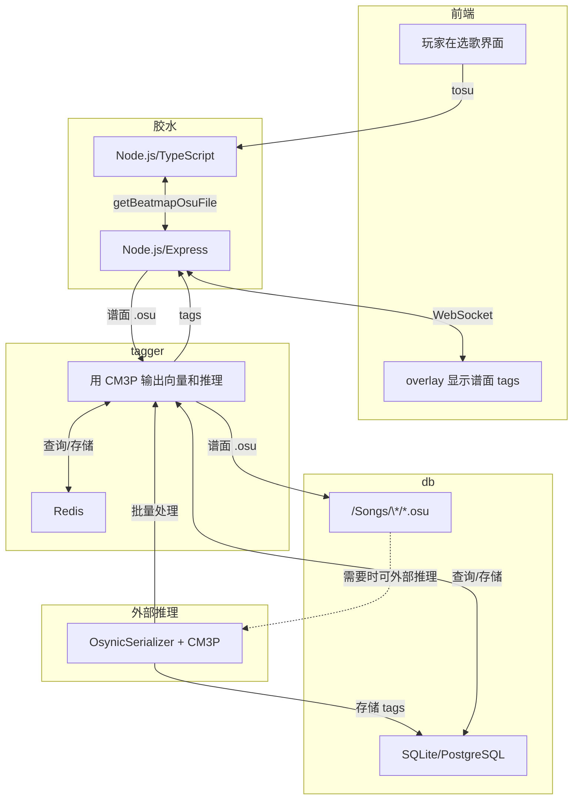

# Skin

## Judgments

判定实际上是一种确定语义色的活。目前 ppy 在这上面做的功夫就是标准化。我对此有不同看法，并且我想使用 <https://github.com/Ks4four/moe-palettes-ksfour>。

### 存值

在 stable，ppy 采用已有的计数器来存值，而不是各个 mode 都有独立的存值。

| 判定 | Standard | Taiko | Catch | Mania |
| :--- | :--- | :--- | :--- | :--- |
| Geki (激) | Combo 结尾（300） | 大饼（良） | Combo 结尾 | 320 (MAX) |
| 300 | 300 | 良 | Fruits | 300 |
| Katu (喝) | Combo 结尾 （100） | 大饼（可） | Missed Droplets | 200 |
| 100 | 100 | 可 | Drops | 100 |
| 50 | 50 | - | Droplets | 50 |
| Miss | Miss | 不可 | Missed Fruits & Drops | Miss |

### 配色

| osu! mania | 颜色 |
| :--- | :--- |
| 320 | 彩色 |
| 300 | 金色 |
| 200 | 绿色 |
| 100 | 蓝色 |
| 50 | 灰色 |
| 0 | 红色 |

| lazer! standard | 颜色 |
| :--- | :--- |
| 300 | 明蓝色 |
| 200 | 暗绿色 |
| 50 | 黄色 |
| 0 | 红色 |

| lazer! mania | 颜色 |
| :--- | :--- |
| 320 | 明蓝色 |
| 300 | 暗蓝色 |
| 200 | 明绿色 |
| 100 | 暗绿色 |
| 50 | 黄色 |
| 0 | 红色 |

|  SM5 | 颜色 |
| :--- | :--- |
| flawless | 明蓝色 |
| perfect | 金色 |
| great | 绿色 |
| good | 暗蓝色 |
| bad | 紫色 |
| miss | 红色 |

SM5 可参看：<https://github.com/stepmania/stepmania/blob/d55acb1ba26f1c5b5e3048d6d6c0bd116625216f/Themes/default/Graphics/Judgment%20Normal%202x6.png>。

| iidx 31 | 颜色 |
| :--- | :--- |
| pg | 青色 |
| gr | 金色 |
| gd | 暗黄色 |
| bd | 暗橙色 |
| pr | 深红色 |
| cb | 外围是红色的白色 |
| fast | 亮蓝色 |
| slow | 亮红色 |

# tosu-obs-overlay

给朋友做的 tosu obs overlay。

## 目标

- 尽量让观众看得有趣（假设观众无音游经验）
- 尽量平铺 debug 级别的信息
- 尽量吸收其他音游的东西
- **Modular by design, batteries-included by default**

## 功能

- [x] 「**电池包含在内**」级别的普通内容展示
- [x] focus session：当谱面进行到难点时，就显式显示
- [x] 精确 acc（五位数）：手动计算，避免 mania 的四舍五入 "95.00%" 但还是 A 的情况
- [ ] **模块化。**

## 灵感

许多实现是我后来发现没什么用的，所以就不用 TODO List 了。

### standard

- [x] focus session：最开始就是为 std 设计的，只是后来给其他模式用上了

### taiko

- [x] 摆正 taiko 的 graph 的位置，而不是单在左侧

### mania

#### iidx-like

- [x] 新结算界面：beatoraja 结算页面下的三个图表 <https://youtu.be/DhfmOhBDf0I>
- [x] `判定傾向`：平均误差 <https://youtu.be/DhfmOhBDf0I>
- [ ] 数字血量
- beatoraja 占位零：`PF: 0194` 里面的 `0` 可见度调低点
  - 不实现理由：一张 om 谱可能有 10k+ notes，但是 iidx 谱面只有 10k-
- `MAX-`, `SS-`, ...

#### etterna

- [ ] 新结算界面：散点图
- flags/cleartypes
  - 不实现理由：感觉没什么人在意
- grades 动画（不停 rolling，最后 rolling 到真的等级）
  - 不实现理由：osu! 的评级并不是黑箱，不过实现起来非常简单，无所谓

### catch

- [ ] 有人在意

## 设计

虽然 tosu 中的 metadata 将 layout 分为 obs 和 ingame，但是在我看来实际情况是 ingame 和 stream。
- ingame layout 是侵入式的。trade off 是它要求 osu! 原本空白的地方。欲设计一个这样的 layout，实际上空白部分很少：[/asset/osu.svg](/asset/osu.svg)，并且观众还无法看到精心设计的 private skin（如果有）。
- stream layout 是非侵入式的。它可以摆放许多个性设计，比如说可以摆放各种动漫角色，或者 l2d。trade off 就是你无法获得源大小的游戏界面。

我第一个项目是 ingame layout，因为我使用 2180p 的屏幕，我没有兴趣使用真正的 stream layout。在这上面我使用了激进的设计：
1. 把我认为观众不感兴趣的地方全部用上了，比如说 Sort by、Group by、playfield 的上方、排行榜、血条、结算页面。
2. 改进和替换不可替换的电池：hit error、key overlay、acc、分数、mod、combo。
3. 没有挡住 fps 和 帧生成时间。这部分留着放手元。

如果你想做 stream layout 方向，我觉得可以实现（但我懒得做或者我试过）的是动画。这方面的审美参考我觉得是像现实中的パチンコ机器那种。立刻可以工作的方案是使用 iidx 素材。
1. fail 动画：播放一个 mp4，然后使用 canva 滤除蓝幕。gif 是备选项。搜索「iidx 閉店演出」。
2. 结算动画：可以做评分的动画，也可以做 flags/cleartypes 的动画（比如 fc）。立刻可以工作的方案有两种：Stepmania 3.9 滚动的评分，和进度条样式（lazer! 做了）。
3. 画面切り替え：玩家在不同界面中切换时（除了暂停，因为暂停不算独立的界面）播放动画。这个很有可能效果不好，因为它有体感延迟（无法处理）。
4. 直接照抄各种游戏的 layout，这需要各个游戏的 assets。我是懒得弄，不过纯网页的上限很高，不至于不能做。

## 推测地图模型

Etterna 可以推测谱面类型。没看过它的实现，因为 std 模式更重要一点。对现有工具进行猜测：

- [ ] 0. 等待 User tags（<https://osu.ppy.sh/wiki/en/Beatmap/Beatmap_tags>）成为事实标准
- [ ] 1. 准备训练数据（[Osynicite/osynic_serializer](https://github.com/Osynicite/osynic_serializer) + [Osynicite/osynic_downloader](https://github.com/Osynicite/osynic_downloader), 还有自己弄的 api 获取对应 tags 的 beatmaps）
- [ ] 2. 训练（[OliBomby/CM3P](https://github.com/OliBomby/CM3P)）
- [ ] 3. 推理（`FastAPI`/`AutoModel` + `AutoProcessor`/`Flask`）
- [ ] 4. 中间件
- [ ] 5. 模型部署（`onnxruntime`, Node.js）
- [ ] 6. 前端（Node.js, tosu）
- [ ] 7. 缓存（`Redis`）

粗略的工作流如下。

# lazer 哲学

we get what we deserve
