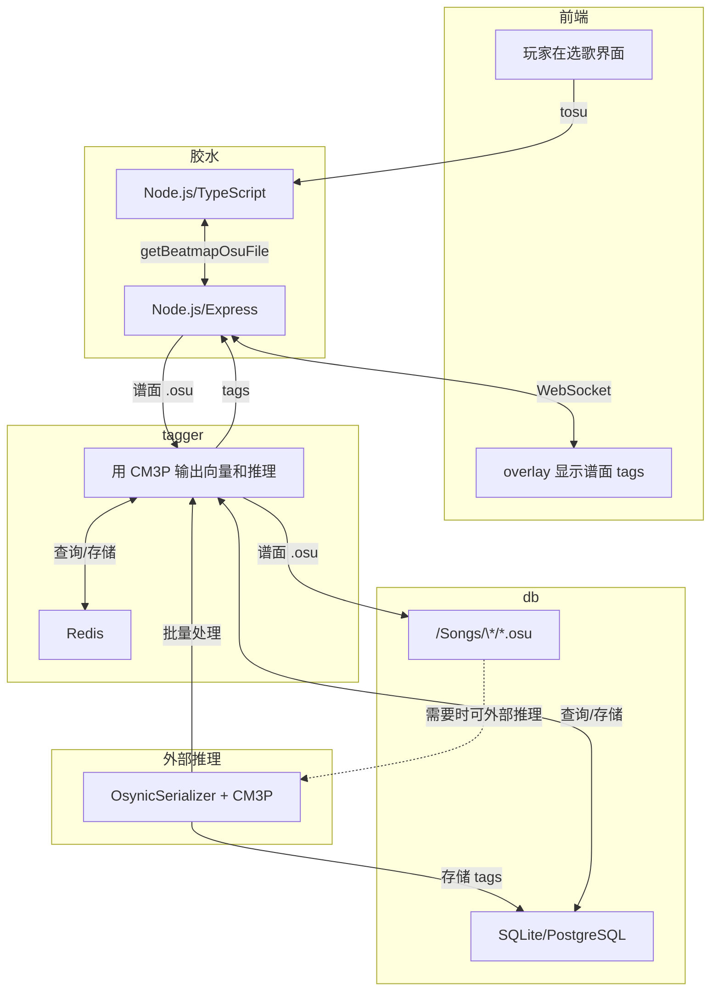

# Skin

## Judgments

### standard

| 判定 |
| :--- |
| 300 |
| 100 |
| 50 |
| Miss |

### taiko

| 判定 | 数值 / 描述 |
| :--- | :--- |
| 良 | 300 |
| 可 | 100 |
| 不可 | Miss |
| Geki 和 Katu | 大 note |

### catch

| 对象 | 数值 / 描述 |
| :--- | :--- |
| fruits | 300 |
| drops | 100 |
| droplets | 50 |
| missed fruits and drops | 0 |
| missed droplets | katu |
| geki | 是有值的，还是 combo 结尾，和 standard 一样。 |

### mania

| 数值 | 对应 |
| :--- | :--- |
| 320 | geki = MAX |
| 300 | 300 |
| 200 | katu |
| 100 | 100 |
| 50 | 50 |
| Miss | Miss |

## osu! mania

| 数值 | 颜色 |
| :--- | :--- |
| 320 | 彩色 |
| 300 | 金色 |
| 200 | 绿色 |
| 100 | 蓝色 |
| 50 | 灰色 |
| 0 | 红色 |

## lazer! standard

| 数值 | 颜色 |
| :--- | :--- |
| 300 | 明蓝色 |
| 200 | 暗绿色 |
| 50 | 黄色 |
| 0 | 红色 |

## lazer! mania

| 数值 | 颜色 |
| :--- | :--- |
| 320 | 明蓝色 |
| 300 | 暗蓝色 |
| 200 | 明绿色 |
| 100 | 暗绿色 |
| 50 | 黄色 |
| 0 | 红色 |

## SM5

<https://github.com/stepmania/stepmania/blob/d55acb1ba26f1c5b5e3048d6d6c0bd116625216f/Themes/default/Graphics/Judgment%20Normal%202x6.png>

| 判定 | 颜色 |
| :--- | :--- |
| flawless | 明蓝色 |
| perfect | 金色 |
| great | 绿色 |
| good | 暗蓝色 |
| bad | 紫色 |
| miss | 红色 |

## iidx 31

| 判定 | 颜色 / 描述 |
| :--- | :--- |
| pg | 青色 |
| gr | 金色 |
| gd | 暗黄色 |
| bd | 暗橙色 |
| pr | 深红色 |
| cb | 外围是红色的白色 |
| fast | 亮蓝色 |
| slow | 亮红色 |

# tosu-obs-overlay

给朋友做的 tosu obs overlay。

这个 README 只是 todo list。

## 目标

- 尽量让观众看得有趣（假设观众无音游经验）
- 尽量平铺 debug 级别的信息
- 尽量吸收其他音游的东西
- **Modular by design, batteries-included by default**

## 实现

- [x] 普通的内容实现（比如，所有难度种类及其图表）
- [x] focus session：显式声明难点，让观众知道难在哪里
- [x] 精确 acc（五位数）：手动计算，避免 mania 的四舍五入 "95.00%" 但还是 A 的情况
- [x] **电池包含在内。**
- [ ] **模块化。**

## 灵感

### standard

- [x] focus session：最开始就是为 std 设计的，只是后来给其他模式用上了

### taiko

- [x] 摆正 taiko 在图表的位置，而不是单在左侧

### mania

#### iidx-like

- [x] 新结算界面：beatoraja 结算页面下的三个图表 <https://youtu.be/DhfmOhBDf0I>
- [ ] beatoraja 占位零：`PF: 0194` 里面的 `0` 可见度调低点
  - 不实现理由：一张 om 谱可能有 10k+ notes，但是 iidx 谱面只有 10k-
- [x] `判定傾向`：平均误差 <https://youtu.be/DhfmOhBDf0I>
- [ ] `MAX-`, `SS-`, ...
- [ ] 数字血量

#### etterna

- [ ] flags/cleartypes
- [ ] grades 动画（不停 rolling，最后 rolling 到真的等级）
  - 不实现理由：osu! 的评级并不是黑箱，不过实现起来非常简单，无所谓
- [ ] 新结算界面：散点图

### catch

- [ ] 有人在意

## 推测地图模型

Etterna 可以推测谱面类型。没看过它的实现，因为 std 模式更重要一点。对现有工具进行猜测：

- [ ] 0. 等待 User tags（<https://osu.ppy.sh/wiki/en/Beatmap/Beatmap_tags>）成为事实标准
- [ ] 1. 准备训练数据（[Osynicite/osynic_serializer](https://github.com/Osynicite/osynic_serializer) + [Osynicite/osynic_downloader](https://github.com/Osynicite/osynic_downloader), 还有自己弄的 api 获取对应 tags 的 beatmaps）
- [ ] 2. 训练（[OliBomby/CM3P](https://github.com/OliBomby/CM3P)）
- [ ] 3. 推理（`FastAPI`/`AutoModel` + `AutoProcessor`/`Flask`）
- [ ] 4. 中间件
- [ ] 5. 模型部署（`onnxruntime`, Node.js）
- [ ] 6. 前端（Node.js, tosu）
- [ ] 7. 缓存（`Redis`）

粗略的工作流如下。

